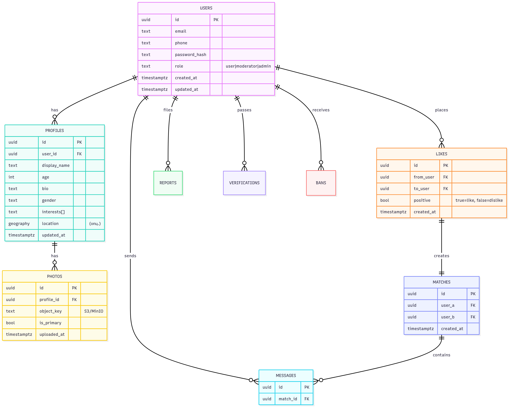

# Malina — Backend
## Описание проекта
Это серверная часть платформы для онлайн-знакомств. Основная задача бэкенда — предоставление API для взаимодействия с пользователями, хранения данных и реализации основных функций приложения, таких как регистрация, авторизация, управление профилями, поиск анкет, обмен сообщениями, система лайков и мэтчей.

## Стек технологий
**Язык программирования:** Python/Go

**API:** REST

**База данных:** PostgreSQL

**Документация API:** OpenAPI (Swagger)

**Кэширование:** Redis

**Контейнеризация:** Docker

**Хостинг:** Railway/Heroku

**Тестирование:** Pytest/go test

**Наблюдаемость:** Prometheus, Grafana, Loki.

**Безопасность:** JWT/OAuth2, rate‑limits, Trivy, Snyk.

## Архитектура модулей

- `auth` — регистрация/логин (e‑mail/телефон, соц‑логин), JWT, refresh‑токены.
- `profile` — анкеты, фото, интересы, гео.
- `match` — лайки/дизлайки, фильтры, взаимные совпадения.
- `chat` — 1:1 сообщения, WS‑подключения, доставлен/прочитан.
- `moderation` — жалобы, бан/мьют, репутация.
- `admin` — админ‑API (роли, статистика, модерация).

## Роли и сценарии использования

**Гость**: регистрация, просмотр маркетинговых страниц.

**Пользователь**: управление профилем, поиск анкет других пользователей, загрузка фото, лайк/дизлайк, просмотр совпадений, переписка.

**Модератор**: обработка жалоб, блокировки, скрытие контента.

**Администратор**: управление ролями, конфигурацией, метриками.

### Примеры сценариев

- Пользователь настраивает профиль → получает ленту кандидатов → ставит лайк → при взаимности создаётся матч → начинается чат.
- Пользователь отправляет жалобу → модератор рассматривает → применяет санкции.

## Схема БД

## API

Находится в файле [api-spec.yaml](api-spec.yaml)

## SWAGGER

Для получения доступа к схеме SWAGGER нужно перейти по http://localhost:8080/swagger-ui/index.html#/ 
